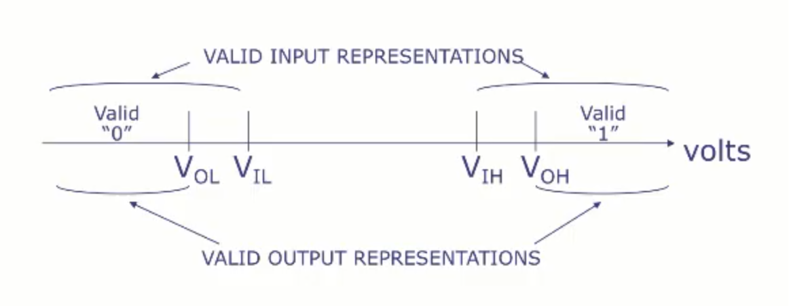
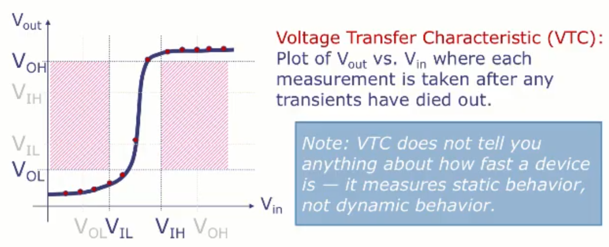
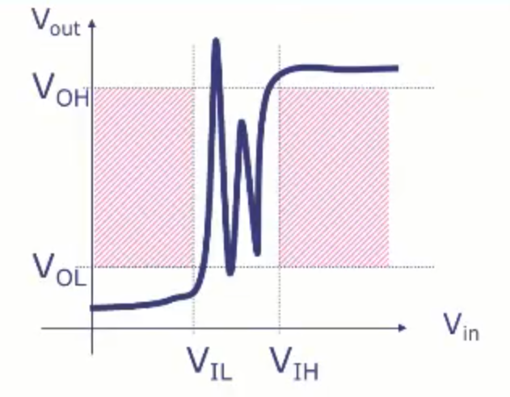

# Lecture 1 - The Digital Abstraction
This course covers 3 main modules. The first module discusses digital design, combinational and sequential circuits. The second module teaches assembly language, processor architecture, caches, pipelining, etc. The third module talks about entire computer systems like operating systems, virtual memory, I/O, etc.

Each of these modules represents one level of abstraction. Layers of abstraction higher on the hierarchy hide a lot of the complexity of the lower layers of the hierarchy. And even though the exact implementation of any one of these layers may change in the future, their underlying concepts remain the same and are long-lived.

## Digital and Analog Systems
Analog values are values that vary continuously over time. Digital values are values that vary discretely over time. Most computing systems are digital systems because digital systems are just a lot more resilient to noise. Analog computing systems are rare.

Since a computer is a digital system and voltage is an analog value, we need to have convention to convert an analog input into a digital one. We could simply decide a threshold value $V_{th}$, and say that anything above the threshold is a 1 and below it is a 0, but in this case a little bit of noise added to a signal that is close to the threshold can end up flipping bits.

Instead, we define two thresholds - $V_l$ and $V_h$. Any signal below $V_l$ is a 0, and any signal above $V_h$ is a 1. Any signal in between $V_l$ and $V_h$ is _undefined_, and the system is allowed to behave however it wants in that case (even in an undefined manner).

However, there is one more problem. If a system sends a signal very close to $V_l$ or $V_h$, a small amount of noise could push that signal into the undefined zone. We solve this by having different high and low thresholds for input and output - $V_{ol}$, $V_{oh}$, $V_{il}$, $V_{ih}$. This means that if a system outputs a 0 that is close to $V_{ol}$ and some noise pushes it to be higher, the value can still be lower that $V_{il}$, and the system that takes that signal as an input will still correctly interpret it as a 0. This gives us a much better tolerance towards noise. Of course, this means that $V_{ol} < V_{il} < V_{ih} < V_{oh}$.

## Voltage Transfer Characteristic
The VTC is a plot of $V_{out}$ vs $V_{in}$. Essentially, it is a plot showing how the output voltage changes as the input voltage changes for a particular device. It shows you static behaviour, which means it does not tell you anything about how fast the device responds.

This is the VTC for a buffer, which is essentially a repeater. It outputs a 0 when it gets a valid 0, and a 1 when it gets a valid 1.

One interesting observation is that in the center of the input range (i.e. invalid input ranges), a small change in the input causes a large change in the output. This means that there has to be some kind of amplification in the device.

Also note that the VTC is allowed to do whatever it wants for invalid inputs. So the below VTC is also a valid VTC for a buffer. It is not a VTC that you would want to have, but it is valid.

The next few lectures (lecture 2-5) talk about combinational circuits, which are circuits where the output only depends on the current inputs, and not the past inputs/outputs. These circuits have no memory. Lectures 6-8 will talk about sequential circuits, which have memory and the current output depends on current input and past inputs/outputs.
