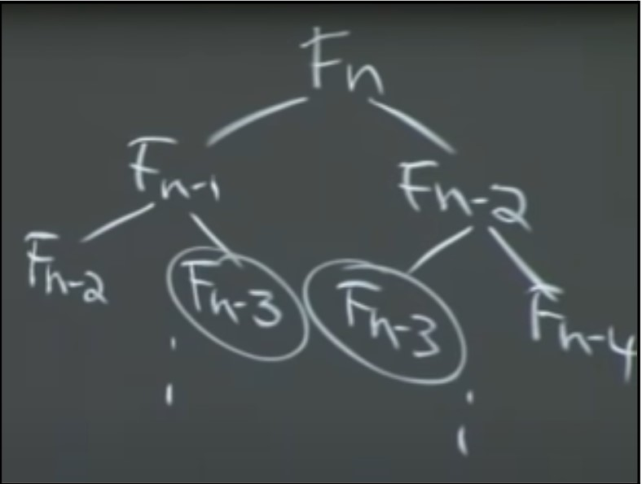

# Lecture 19 - Dynamic Programming 1: Fibonacci, Shortest Paths
Dynamic programming is a very powerful algorithm design paradigm. Dynamic programming can be thought of as a smart way of applying brute force. Dynamic programming breaks a problem into smaller sub-problems, solves the sub problem, and uses the same solution to solve the higher problem. It is well suited to optimization problems.

~~~
Dynamic programming = recursion + memoization + guessing
~~~

Guess an algorithm and all the possible steps for that algorithm. Guess all possible algorithms and then take the best one.

## Fibonacci Numbers
A naive algorithm to calculate fibonacci numbers is

~~~python
fibonacci(n):
    if n <= 2:
        f = 1
    else:
        f = fibonacci(n-1) + fibonacci(n-2)
    return f
~~~

This is a very inefficient algorithm because the recursion is exponential.
The time complexity of this algorithm can be written as -

$$T(n) = T(n-1) + T(n-2) +(1)$$

The solution to this complexity is exponential, $\Theta$(2n/2), which is pretty bad. A better way to do this is by dynamic programming.

## Memoization
Memoization is basically storing the solutions to smaller problems in a data structure (usually a hash table) and using memory to speed up computation.

Calculating fibonacci numbers using memoization can be implemented as -

~~~python
memo = {}
fibonacci(n):
    if n in memo:
        return memo[n]
    if n <= 2:
        f = 1
    else:
        f = fibonacci(n-1) + fibonacci(n-2)
        memo[n] = f
    return f
~~~

Looking at the dictionary makes sure that we don’t repeat calculations we have already done. You can do this with any recursive algorithm. You may not be able to do this in contexts, however, because of memory limits, but you can still store a few examples to help your computation.

It is easy to see how this optimization helps our computation time. For example, if we draw a recursion tree, it would look something like this -

To compute Fn, we have to compute Fn-1 and Fn-2 However, once we have computed Fn-2, we should already have computed Fn-3, and therefore we should be able to compute Fn-1 in constant time if only we remembered the result of Fn-2 and Fn-3. This means we can completely drop one half of the recursion tree (the right half).

Another way of thinking about it is that Fn recurses only the first time it is called, and every other time it returns in constant time after the dictionary lookup. So we make n calls to compute Fn, and each call takes constant time (because we ignore the recursion). Therefore, the time complexity of F is now $\Theta$(n). This is a general technique used to calculate the total cost for any DP with memoization.

## DP Cost With Memoization
To see why each call takes constant time and why we can ignore the time taken by recursive calls, imagine an execution of the algorithm.

If you want to compute Fn, you need to compute Fn-1 + Fn-2. We recurse once (on the Fn-1 call) and now we need to compute Fn-2 + Fn-3. We recurse again (on the Fn-2 call) and now we need to compute Fn-3 + Fn-4, and so on. We eventually get to the base case of n=2, which immediately returns 1. Now we move up one level in the recursion tree, which requires us to compute F3, which we can return in constant time since we have F2 and F1 in the memo table (and also by definition). We move up one more level and now we need to compute F4, which also returns in constant time because we have F3 and F2 in the memo table. Similarly, F5, F6, …, Fn all return in constant time. Therefore, we had n recursive calls or subproblems, and each sub problem takes O(1) to solve.

This is a general method to calculate the running time of a dynamic program.

~~~
Running Time = #subproblems * time per subproblem
~~~

When calculating the time per subproblem, we ignore all recursive calls and assume they take constant time, as we shown above.

Another paradigm of writing the fibonacci algorithm (and all dynamic programming algorithms), is to start from the bottom up.

~~~python
fib = {}
for k in range(1, n+1):
    if k <= 2:
        f = 1
    else:
        f = fib[k-1] + fib[k-2]
    fib[k] = f
return f
~~~

Here, we start calculating from the bottom and go up, but this algorithm performs exactly the same calculations as the memoized algorithm. This version of the algorithm allows you to save space on your dictionary/list as well. Once you calculate a fibonacci number, you only need to store the last 2 fibonacci numbers to calculate the next one. So you don’t need a big dictionary with fibonacci numbers for all the problems you have solved so far. The bottom up approach saves space compared to the memoized approach. It’s also obvious that the running time of this algorithm is linear.

## Shortest Paths
Suppose we are trying to solve a single source shortest path problem from vertex s to vertex v. We can use naive recursion and reduce our current problem down to a smaller subproblem

1. Consider all edges going to v. The shortest path has to include one of them.
2. The edges going to v will all be connected to some vertex u. The shortest path will then have the weight $\delta(s,u)+w(u,v)$for all u connected to v.
3. The problem to be solved is now reduced from (s, v) to $min_{(u,v) in E}(\delta(s, u) + w(u, v))$.

But this algorithm does not work on graphs with cycles (we get stuck in an infinite loop).

The intuition is this - suppose you want to calculate the shortest path from s to v, $\delta(s,v)$. We know that the shortest path has to include one of the edges coming into v. So we choose a random edge coming into v, and assume that it is included in the shortest path. Then, we calculate the shortest path from u to that node instead of from u to v. We then do this for all nodes connected to v and take the minimum value.

$$\delta(s,v)=min_{(u, v) \in E}(\delta(s, u) + w(u,v))$$

~~~python
def shortest_path(s, v):
    return min(shortest_path(s, u) + weight(u, v) for u in v.neighbours)
~~~

This is a $O(V+E)$ algorithm. This algorithm is essentially doing a depth-first search.