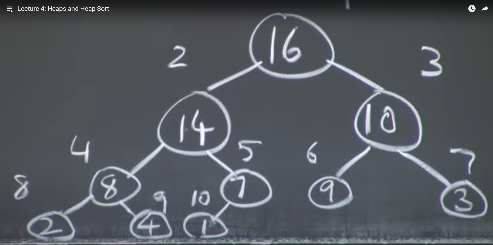

# Heaps and Heap Sort
## Heaps
Heaps are an implementation of a priority queue. Heaps can do the following operations -
1. Insert(x) - Insert element x into the heap
2. Max(x) - Return the max element in the heap
3. Extract_max(x) - Return the max element and remove it from the heap

Heaps are just an array visualized as a nearly complete binary tree. We map an array to a binary tree by setting the first element as the root, then the next element as the first child, the next as the right child, and so on, in order. So for any node i in the tree, its parent is node i/2, its left child is node 2i, its right child is node 2i + 1.

There are 2 types of heaps - min heaps and max heaps. Min heaps have the property that the root of their tree representation is the smallest element in the array, and the key of every node i is less than or equal to the keys of its children. Max heaps have the property that the root of their tree representation is the largest element in the array, and the key of every node i is greater than or equal to the keys of its children.

For heaps to be useful, we need the heaps to maintain their max/min property as we perform extract max or extract min on them. We also need a function to build a max or min heap from a normal array.

## Heap Methods
1. max_heapify() or min_heapify() - Assumes that the heap violates the max/min property at exactly one node and fixes it. More specifically, it assumes that the violation occurs at the root of a subtree, and that the subtree rooted at the violation satisfies the max/min property.

    Max or min heapify starts at the violation, compares the violating element with its children, and then swaps the violating element with the bigger child if max, smaller child if min, and then calls itself on the node with which it was just swapped to see if it didn’t create a new violation. Max/min heapify takes in 2 arguments - the tree visualization of the array, and the index in the tree at which the violation occurs.

2. Build_max_heap() or build_min_heap() - Builds a max/min heap given a normal array. The pseudocode for build_max_heap() of build_min_heap() can be written as -

~~~
def build_heap(A, n, max = True):
    for i in range(n/2, 1, -1):
       if max:
           max_heapify(A, i)
       else:
           min_heapify(A, i)
    return A
~~~
{: .language-python}

The complexity of max_heapify or min_heapify is $O(log\,n)$, which isn’t hard to see because for one call of max/min_heapify, we may be doing at most $log(n)$ swaps and recursions. The complexity of build_heap() is $O(n)$, since we call max/min_heapify n/2 times, but each call of max/min_heapify does not take $O(log\,n)$ time. The upper limit of one call of max/min heapify at a level of the tree is log(i), where i is the level of the tree, which is not n. Doing a careful analysis and taking the sum of the complexities of max/min heapify over the levels, we find that the complexity of build_heap() is linear.

## Heap Sort
Since we can retrieve the max or the min of the array in constant time, we can use this property to sort a given array. We first build a min heap from the array. Then, while there are elements left in the heap, we take the root element (i.e. the smallest element), swap it with the last element (i.e. the largest element). We then remove this last element of the heap from the heap and add it to our sorted list. But we have now violated the min heap property of our heap, since the root element is now the biggest element. So we run min heapify on our heap. Repeat.

The complexity of this algorithm is $O(n \cdot log\,n)$, since building a min heap is $O(n)$, but we extract n elements, and do min heapify each time, which is $O(log\,n)$. So our complexity is $O(n \cdot log\,n)$.
