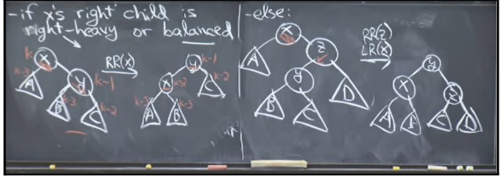

# AVL Trees, AVL Sort
AVL Trees were the original way to keep BSTs balanced.

The height of a tree is defined as the length of the longest path from the root of the tree down to a leaf. The height of a node is defined as the length of the longest path from the node down to a leaf.

The height of a node is 1 + max(height of left child, height of right child).

The invariant in AVL Trees is that the height of the left and the right subtrees of any node differ by at most 1.

In the worst case, when one subtree is always 1 deeper than the other subtree for all nodes in the tree, we want the height of the tree to still be $O(log\,n)$. In the worst case, the number of nodes of an AVL tree of height $h$, ${N}_{h}$, is

$$ {N}_{h} = 1 + {N}_{h-1} + {N}_{h-2} $$

This is because the number of nodes at height h is 1 + the number of nodes in the left child and the right child. One of the children has a height h-1 and one has a height h-2.
We can solve this recurrence to get an expression for n, but we don’t need to. This recurrence is going to be larger than the fibonacci recurrence at each step, so we can use the fibonacci recurrence’s closed form as an approximation.

$$ Nh > F(h) $$

$$ F(h) = h/5 $$

$$ Nh = n > h/5 $$

$$ h = 1.44*{log}_{2}\,(n) $$

$$ h = \Theta(log\,n) $$

So we call an AVL tree a balanced tree since $h = \Theta(log\,n)$.

## AVL Insert
There are 2 steps to insert a key into an AVL tree -
1. Find the location where you want to insert using binary search.
2. Insert and then fix the AVL property that we just violated.

We fix the AVL property after we insert by using rotations.

## Rotations

If you insert a node and end up getting a straight line path from the node which violates the AVL property to the newly added node, then we can fix it in one rotation. If we insert a node and get a zig-zag path from the node which violates the AVL property to the newly added node, we first rotate the middle node in the zig-zag path, which results in a straight line path as in the first case, which we can fix in one rotation.

## Fixing the AVL Property

Let us assume that the highest node that violates  the AVL property is x (in the diagram above), and that x is doubly heavy towards the right. Now we have 2 cases. x’s right child can be either right heavy or balanced, or x’s right child can be left heavy.

If x’s right child is right-heavy or balanced, then we can fix the AVL property by doing left rotate(x) (Eric wrote RR(x), which is wrong. It should be LR(x)). This is the simple one rotation case.

If x’s right child is left-heavy, we first right rotate x’s right child, which makes it balanced and brings it into case 1, and then we left-rotate x.

