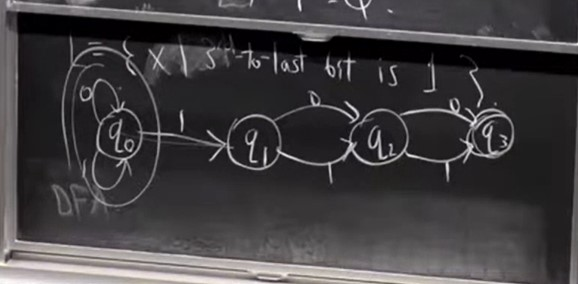
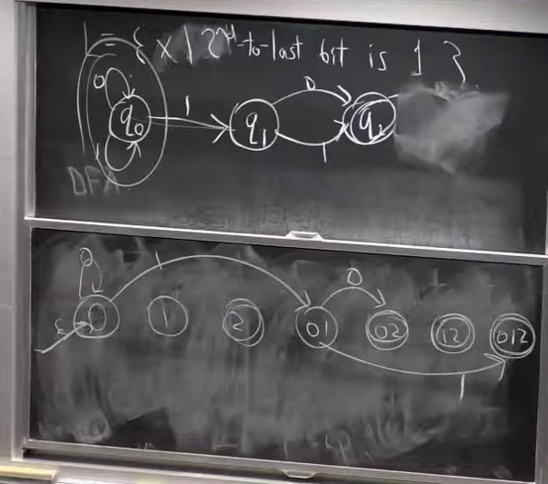

# Lecture 3 - Finite State Automata & Regular Languages

## Finite Automata
A finite automaton is the same as a finite state machine. It has a finite set of states
that it can be in, and it takes input from a set called its alphabet. It has a transition
function that takes one alphabet and the current state as input and transitions to the next
state.

The notation we will use for these quantities is the following -

| $ Q $ | Finite set of states |  
| $ \Sigma $ | Finite alphabet |  
| $ \delta: Q \times \Sigma \rightarrow Q $ | Transition function |  
| $ q_0 $ | Start state |
| $ F \subset Q $ | Accepted states |

We call $$ L = {{0, 1}}^{*} $$ a _language_. In this case, a language is the set of all binary
strings of length 0 or more. A language is just any set of strings. We say that a language is 
_accepted_ or _recognized_ by an automaton if the automaton ends up in an accepting state for 
all strings in the language, and we denote that as $ L(M) $, meaning $L$ is a language recognized 
by the finite automaton $M$. We say that $L$ is a _regular_ language if we can design an automaton
to accept that language.

Regular languages have the following properties -
1. The intersection of regular languages is regular
2. Complement of a regular language is regular
3. Regular languages are closed under union, intersection and complement
4. All finite languages are regular
 
An example of a language that is not regular is the language of all palindromes.
We can prove this using the pigeonhole principle. A finite state automaton has 
a finite number of states, and this language can have strings of infinite length.
Since the amount of "memory" a finite automaton has is essentially equal to the 
number of states it has, it cannot store inputs whose length is more than the
number of states it has. Therefore, we cannot design a finite state automaton for 
this language, so it is not regular. This was just a rough proof, but the lecture 
gives a detailed proof.

## Nondeterministic Finite State Automata
A non-deterministic finite state automaton is an extension of DFAs. It has the property that
it can have any number of ways to transition from one state to another, even when it reads the 
same symbol. That means that if it is in a state $q_i$, it can have any number of paths to follow
when it reads the symbol 0, for example, whereas a DFA only has one path per symbol.

For example, we have the NDFA that accepts the language where the 3rd to last bit is a 1, which
can be drawn as given below -

It turns out that NDFAs are essentially equivalent to DFAs. For every NDFA that accepts a language $L$,
we can construct a DFA that accepts the same language, and for every DFA that accepts a language $L$, 
we can construct an NDFA that accepts the same language.

We do this by power set construction. First of all, converting from a DFA to an NDFA is trivial. All
DFAs are NDFAs. To convert from an NDFA to a DFA, we construct a power set of the states the NDFA can
be in. For example, if the NDFA can be in states {0, 1, 2}, then we construct a power set {0, 1, 2, 01, 02, 12, 012}
(we exclude the null element in the power set). We can then convert from an NDFA to a DFA by following 
transitions from the start state of the NDFA, and whenever we read a character that can transition to
multiple states, we jump to that element in the power set that has all of those states.

For example, if we consider the same NDFA given above, and we start at the start state and read a 1, 
we can end up in either the start state itself (state 0) or state 1. So in the DFA we transition to
state 01.

An example conversion is shown below for the NDFA that accepts languages where the second to last bit 
is a 1 to its corresponding DFA.

