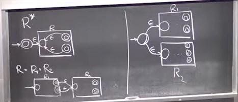

# Regular Expressions, Context-Free Grammars

## Regular Expressions to DFAs
Regular expressions are basically equivalent to DFAs. To show this, we have to show that,
given a regular expression, we can design a DFA that accepts the same language as the regular
expression, and given a DFA, we can write a regular expression that accepts the same language
as the DFA.

To prove the first part of the implication, regular expression $\to$ DFA, we first show that we can
design an NFA to represent a regular expression. We then know how to convert from an NFA to a DFA.

Regular expressions have three important operations - union, concatenation, and the * operation (zero
or more). Suppose we have a regular expression without any of these operations, then this regular
expression can be represented by a simple NFA that looks like a simple path. If the regular expression
is `0110`, for example, the NFA would just be a start node, followed by 4 other nodes, which it 
reaches if it reads the characters `0110` in sequence, the last of which is the accepting state.

So we can easily design an NFA for a regular expression that doesn't use any operations. Now we show 
that if any two regular expressions are combined with an operation, then we can combine the 
corresponding NFAs for the two expressions using a simple method. The methods are shown in the 
photo below -

If the expressions are combined using the union operation - `01|10`, then we just take the two NFAs
for the two expressions and put a common start state before both of them with null transitions to the
start states of the two NFAs. Think of this as similar to an OR gate.

If the expressions are concatenated, think of this as similar to an AND gate.

If an expression has the * operation, we add transitions from the accepting state back to the start 
state with null transitions, as shown above.

## DFAs to Regular Expressions
To convert from a DFA to a regular expression, we first convert from a DFA to a GNFA. A GNFA stands
for General NFA. A general NFA is just like an NFA, but its transitions function operates on regular
expressions instead of an alphabet. So you can have regular expressions on the arrows between states.

For our purposes, we will make GNFAs satisfy the constraint that they only have one start state with
only outgoing edges, and only one accepting state with only incoming edges. Once we convert from a DFA
to a GNFA with some number of states k, we reduce the k states down to 2 (as shown in the lecture, 
pretty straightforward). Once we are left with 2 states in our GNFA, we can write it as a regular 
expression.

## Context-Free Grammars
A context-free grammar is a set of rules for generating any string in a language. It can be defined
by the following tuple - (V, $\Sigma$, R, S). V is the set of variables for the grammar, $\Sigma$ 
is the alphabet of the language we are going to generate, R is the set of rules for generating the 
language, and S is the start variable from which we start generation.

An example of a context-free grammar is 

Languages that are generated from a context-free grammar are called context-free languages. As you 
might expect, since CFG is a more powerful model of computation as compared to regular expressions
or DFAs, regular languages are a subset of context-free languages. That is, every regular language 
is a context-free language (i.e. can be expressed with a CFG).

## Pushdown Automata
Pushdown automata (PDAs) are a more powerful variation of NFAs. Think of them as basically NFAs
with access to a stack onto which they can push items and pop items. They allow us to express a 
larger set of languages.

Even though NFAs are equivalent to DFAs, PDAs are not equivalent to their deterministic counterparts.
That is, DPDAs != PDAs.