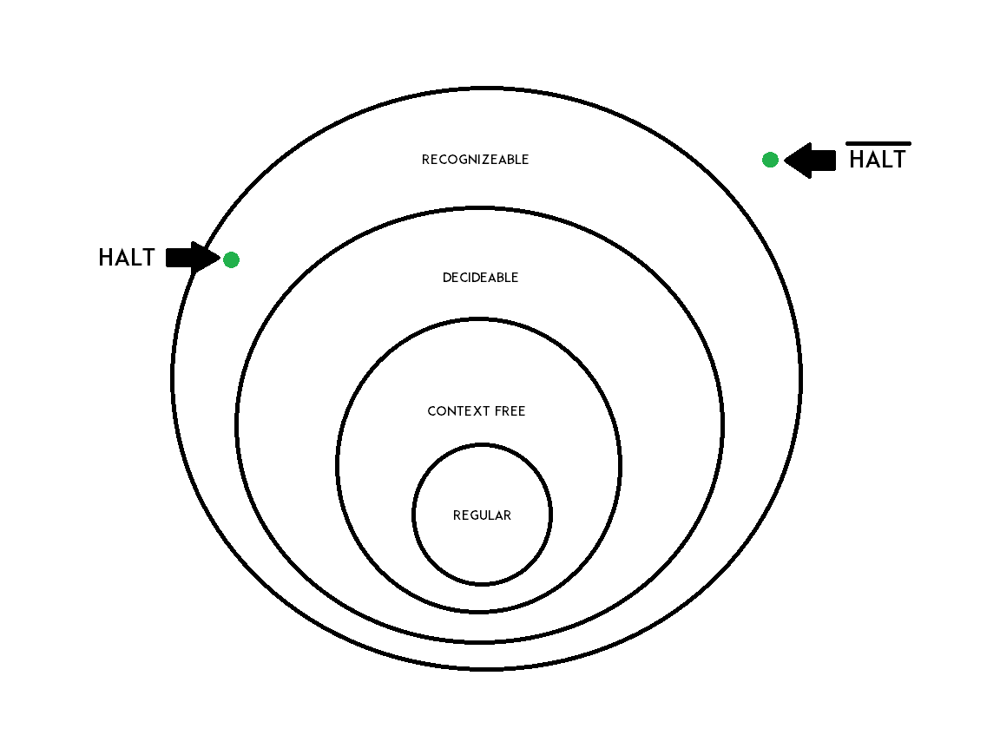
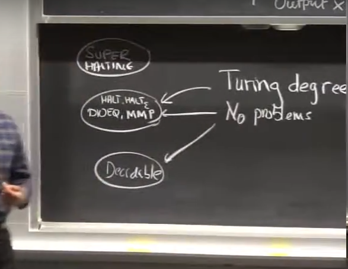

# Turing Recognizability, Oracles

## Turing Recognizability
We now define a new kind of language, a Turing Recognizable language - very similar
to a decidable language, with one key difference.

A Turing Recognizable language is a language for which we can construct a Turing
Machine such that, for all inputs in the language, the Turing Machine halts and accepts,
and for all inputs not in the language, the Turing Machine either halts and rejects
or goes into an infinite loop.

The only difference between a decidable and recognizable language is the very last
clause, which allows the machine to go into an infinite loop. This means that the halting 
problem can be phrased in terms of a Turing Recognizable language.

$ HALT = \{\<M\>,x : M halts on x\} $

We can clearly see that for all strings in the language, we can construct a Turing machine 
to either halt and accept (just run M on x), or go into an infinite loop (just run M on x again,
and it will go into an infinite loop if x is not in the language).

We have now seen a few classes of languages of increasing generality, shown in the diagram below -

As you would expect, the halting problem is in the set of recognizable languages but not
in the set of decidable languages. Now if we define a new language, $\overline{HALT}$,
which is the _complement_ of $HALT$, it lies even outside the class of recognizable languages.

## Reductions
Reductions are a way of solving a problem that you don't know how to solve using
a solution to a problem that you do know how to solve. Reductions were seen before
in [6.006](../6.006/index.md) and [6.046](../6.046/index.md). Reductions are seen 
everywhere in computer science, and are especially useful while proving the NP-completeness
(or incompleteness) of some problem. Similarly, you can also use them to show that some 
problems are decidable or undecidable.

Formally, we represent a reduction as $ A \le {}_{T} B $, where the T stands for 
Turing reducibility. This denotes that problem A can be reduced to problem B, where
A is the problem that we want to solve, and B is the problem that we know how to solve.

We can also write this as - `$A$ is decided by $M^B$`, where we call B an "oracle", 
because we get to assume that the Turing Machine M has access to Turing Machine B,
which already knows how to solve its own problem

In a Turing reduction, we can call the oracle any number of times, even zero. We 
are not forced to use the oracle. This is not the case for all kinds of reductions,
for example in case of mapping reductions, you must call the oracle exactly once, 
and you must output the result of the oracle.

Mapping reductions can be a little more helpful that Turing reductions, because 
a mapping reduction between two problems means that the two problems are in the 
same class of languages, which is not guaranteed by a Turing reduction. 

For example, you can come up with a Turing reduction to reduce $HALT$ to $\overline{HALT}$,
but they are in complementary classes. However, we can come up with a mapping 
reduction from the halting problem with no input to the halting problem that 
takes any general input, which means that the two problems are in the same
class of languages.

Fermat's last theorem was proved this way around 1995, when it was shown that 
that halting problem can be reduced to Fermat's last theorem using a mapping
reduction. In other words, if you had an oracle that solved Fermat's last
theorem, you could solve the halting problem.

## Turing Degrees
A Turing degree is a set of problems that have the same difficulty. For example,
the set of all decidable languages forms a Turing degree. The set of all undecidable
problems also forms a Turing degree.

Each Turing degree has ${\aleph}_{0}$ languages. This is because each pair of 
languages in a degree can be reduced to each other, and you need a Turing machine
to do reduce any problem to another. And since there are only ${\aleph}_{0}$ number 
of Turing machines, there can be at most ${\aleph}_{0}$ number of problems in a degree.

Another interesting fact is that there are problems even harder than the halting 
problem. To come up with a problem harder than the halting problem, consider a 
Turing machine that has access to an oracle that solves the halting problem. Now 
we ask whether this new Turing machine will halt on an empty input. 

Using the same proof that we used to prove that the halting problem was undecidable
(i.e, not solvable by a Turing machine), we can prove that this new halting problem
is not solvable by our augmented Turing machine that has access to a halting problem 
oracle. This creates a new class of languages that form another Turing degree.

You can see that this means there are an infinite number of Turing degrees, since
we can always come up with a harder halting problem.
