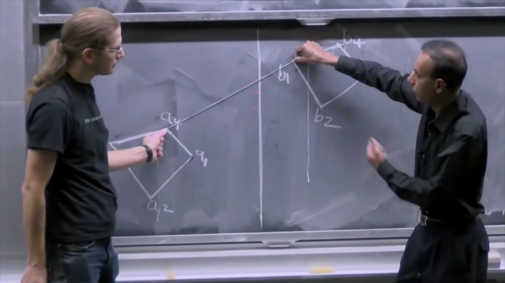
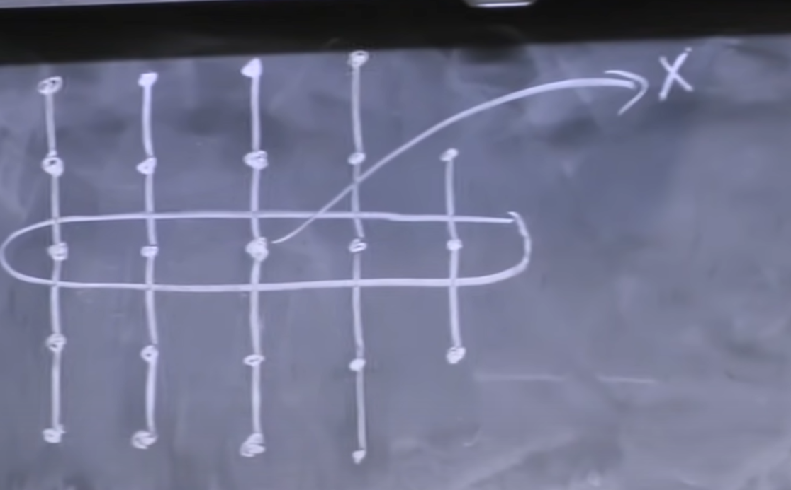
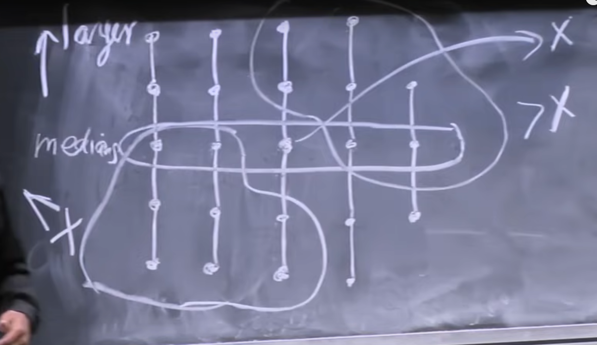
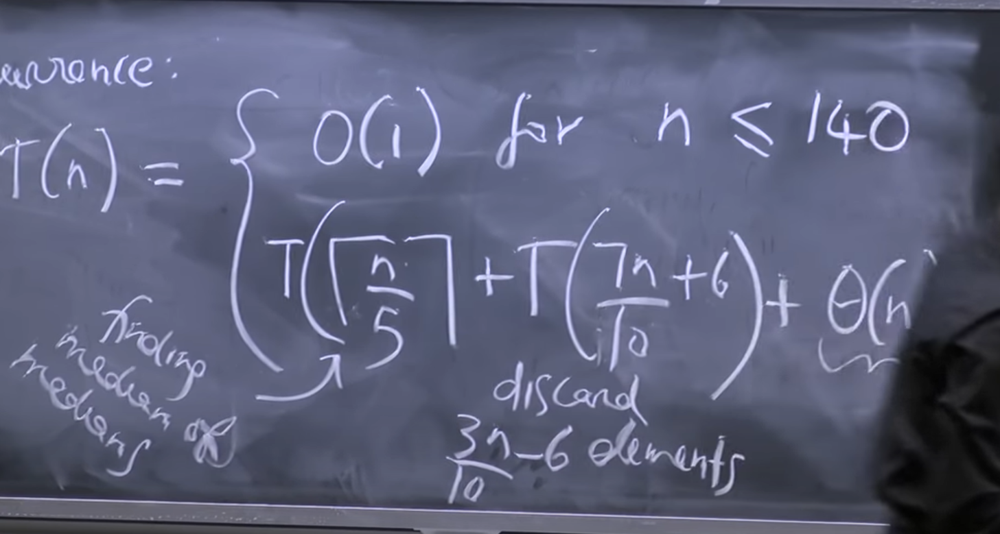

# Lecture 2 - Convex Hull, Median Finding
## Divide & Conquer
The general ideology behind divide and conquer is a simple idea - we divide a problem into “a” subproblems of size n/b, where a is an integer greater than or 
equal to 1 and b is an integer greater than 1. We then usually use the solutions to all other problems and combine them into a single solution for the original problem.
We can write a recurrence for the time complexity of a general divide and conquer algorithm as -

$ T(n) = a \cdot T(n/b) + [w] $

Where w is the work required to merge the “a” solutions to the subproblems.

## Convex Hull
We are given a set of points S = $\{(x_i, y_i)\}$. Our objective is to find a convex polygon with the smallest number of sides that uses the points in S as 
vertices and contains all of the points in S inside it. We can assume that no two points in the set S have the same x coordinate, no two points in S have 
the same y coordinate, and no three points in S are collinear.

We call the convex hull CH(S). CH(S) can be a doubly linked list containing a sequence of points in clockwise order.

There is a simple algorithm that we can use to solve this problem that is not too bad. Given the set of points, we choose a pair of points and connect 
them with a line segment. If all the other points in the set lie on one side of this line segment, then this line segment has to be a part of our convex
hull. Otherwise, we just drop that line segment and move to the next pair of points. This is a really simple algorithm. There are nC2
pairs of points, i.e. $O(n^2)$, and it takes $O(n)$ time to check if all points lie on the same side of the line segment. So the worst case running time 
of this algorithm is $O(n^3)$.

But we can do better with divide and conquer.

## Convex Hull w/ Divide & Conquer
We first sort the set of points according to the x coordinate of the points. We then pick the median point, and divide the set of points into two sets - 
left and right. We then find the convex hull of the two smaller subproblems by recursing
on both subproblems, which gives us two convex hulls that we need to merge together to get our solution. The division into two sets is straightforward, 
but the merge step is interesting, as it is not immediately obvious.

```python
# Rough, untested solution
def CH(S: list) -> list:
    if len(S) < 10:
        # If there are less than 10 points left, we just use
        # the simple brute force algorithm
        return brute_force_ch(S)
    left = S[:len(S)//2]
    right = S[len(S)//2:]
    return merge(CH(left, CH(right))
```
    
The merge routine uses the two finger algorithm to merge the two hulls together. We are given two convex hulls on the opposite side of some dividing line 
(because we chose the two subproblems to be on different sides of some dividing line).

We start with one finger on the rightmost point of the convex hull on the left and one finger on the leftmost point of the convex hull on the right. We then 
set up a while loop in which we keep trying to move our fingers up (one after the other), and calculate the y intercept each time. So in the first iteration, 
we move our right finger clockwise and keep our left finger in the same spot. We then calculate the y intercept of the line joining our two chosen points. If
the y intercept went down, then this line is not a part of the merged hull, so we go back to our previous point. We then move our left finger counterclockwise
and keep our right finger in the same spot and calculate the y intercept. We keep doing this until we try moving both our left and right fingers, and the y 
intercept decreases each time. At this point, we can say that we have found the upper tangent for the merged hull. We then repeat this procedure for finding 
the lower tangent.



The recurrence for this algorithm, as you can clearly see, is T(n) = 2T(n/2) + O(n), which is the same as the merge sort recurrence, and so the time complexity 
of this algorithm is $O(n log n)$. This is the optimal time complexity for the general convex hull problem.

There is a final step left of removing the edges of the two sub hulls now that we have merged them. For doing that we follow a “copy and paste” procedure. 
Let us say that we have found the upper tangent going from point
$a_i$ to point $b_j$, where $a_i$ is a point in the left sub hull and $b_j$ is a point on the right sub hull, and we have found a lower tangent going from point $a_k$
to point $b_m$, where $a_k$ is a point on the left sub hull and $b_m$ is a point on the right sub hull.
We select the edge $(a_i, b_j)$ to be the first edge on our merged hull. We then go clockwise around the right hull and add all the points we see to our merged hull, 
till we get to $b_m$. Once we get to $b_m$, we jump to the left sub hull at point $a_k$ and keep going clockwise around the left hull and adding all the points we 
see until we get to $a_i$. This process gives us a closed, merged convex hull, as you can verify. This is also an O(n) subroutine.

## Median Finding
The problem is simple, to find the median faster than having to sort the list of numbers and look at the median position.

So we want to find the median of a given set of numbers in linear time, if possible, and we will use the divide and conquer approach to do so. We first define 
the rank of an element, which is the number of elements in the given set smaller than or equal to the given element.

Our lower median is the element with rank floor(n+1 / 2) and our upper median is the element with rank ceiling(n+1 / 2). We define a selection routine that 
will select the element with some rank. We can then find the median by just calling the select routine on the rank of the median.

The select routine first chooses an element in the array, x. We don’t choose this number randomly, but use a complex subroutine to choose x cleverly. Once we have 
chosen x, we divide the set of elements into two sub arrays. We iterate through the array and compare each element with x. We put all the elements less than or equal 
to x in the left array, and the elements greater than x in the right array.

We can then calculate the rank of x, which is the length of the left sub array. If the rank of x is the rank we are looking for, we return x, otherwise, If we want 
to find an element of rank less than the rank of x, we recurse on the left sub array, otherwise, we recurse on the right sub array to find the element of rank(x) - 
the rank we are searching for.

However, you can see that we are doing O(n) work here, and if we just chose x randomly, we would end up with an $O(n^2)$ algorithm. We define a complex subroutine 
to choose x that will make sure that we recurse on a problem that is geometrically smaller than the current problem.

We take the set of elements and arrange them into a 2D array with 5 rows, that is, we divide the set of elements into columns of size 5.



We then sort each column of 5 elements, and since all columns are of a fixed size (5) for all subproblems, this takes constant time. We then look at the medians 
of all of these columns, as shown in the figure. We then find the median of these columns by recursing
on the slice we have selected. That median that we find is the x that we will choose. Moreover, this x has the property that the elements to the right and 
up of x are greater than x, and elements to the left and below x are less than x.



This means that choosing this as x will give us fairly balanced subproblems. If we do the math to calculate how many elements will be in each problem, 
we get that the recurrence for the complete algorithm is

$ T(n) = T(n/5) + T(7n/10 + 6) + \Theta(n) $



This recurrence solves to be O(n).
