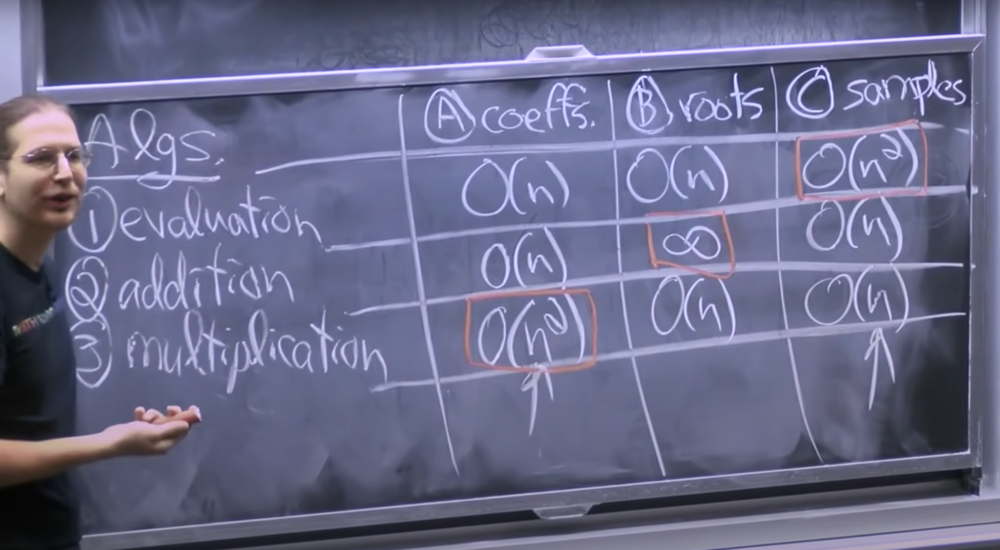
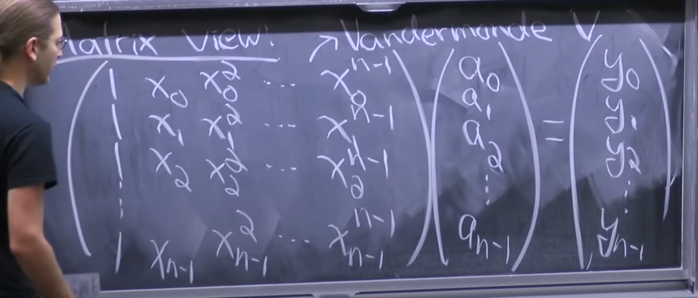

# Lecture 3 - FFT: Divide & Conquer
## Operations on Polynomials
This lecture focuses on fast fourier transforms and operations on polynomials. We represent polynomials as a one dimensional vector of real numbers, 
where the ith term represents the coefficient of $x^i$. Some operations like evaluation and addition of polynomials are easy to do in linear time, 
but doing multiplication of two polynomials efficiently is what we care about, since it is possible to achieve multiplication faster than $O(n^2) 
time with a non-trivial algorithm.

We care about multiplication because multiplication of two vectors finds important applications in signal & image processing, and many other areas. 
We will be able to do one dimensional vector multiplication in $O(n \cdot log n)$ time.

We have three operations we care about - evaluation, addition, and multiplication. We want to be able to do these operations as quickly as possible, 
and we have three representations of polynomials available. Each representation has some advantages and a disadvantage related to the operations we care about.

1.Coefficient Representation - This is the standard representation of polynomials where we state the coefficient of each power of x.
2.Root Representation - We can uniquely specify a polynomial by specifying all of its roots.
3.Sample Representation - We can uniquely specify a polynomial of degree k by specifying the value the polynomial takes at at least k distinct points.

The advantages and disadvantage of each representation is as follows -

Multiplying two polynomials represented by samples is easy, since they are just multiplications of the corresponding sample points. Doing the same 
in coefficient representation is harder because it involves $O(n^2)$ operations.

We can't use the workaround of sampling two polynomials and multiplying them because it takes $O(n^2)$ time to sample n points in coefficient form.

We would like to have a representation that would give us the best of both worlds. We don't have such a representation. Instead, we will be able to 
develop a procedure to convert between the coefficient representation and sample representation in O(n log n) time. This algorithm is called the fast 
fourier transform - taking n samples from a polynomial or transforming a polynomial from the coefficient representation to the sample representation 
and vice versa.

## Fast Fourier Transform
We first represent the polynomial as a matrix along with n points (x values) we want to sample the polynomial at. The way we represent the n points 
we want to sample at is a little different than just x values, and it is called the Vanderbonde matrix.

In the photo above, the Vanderbonde matrix is the matrix on the left. Each row of the matrix is one point $x_i$, and each row contains all the powers of $x_i$ 
we will need. We can represent the Vaderbonde as $V_{jk} = {a}_{j}^{k} $. The column vector on the right has the coefficients of the polynomial written 
in a column. To compute the samples we just have to compute the product. This also gives us a way to convert back from samples to coefficients - we just 
multiply both sides by the inverse of the Vanderbonde matrix.

The problem is that performing the above multiplication will take $O(n^2)$ time. Computing the Vanderbonde matrix and its inverse can be considered free 
because we only have to do it once, but the product takes quadratic time, which is not of any use to us.

## Choosing Sample Points
We go back to the coefficient representation of the polynomial. Let us say we have a polynomial A(x) of degree n that we want to sample for all points in some 
set X, where X has n points.

We can use a divide and conquer algorithm to solve this problem recursively. First, we divide the polynomial A(x) into two smaller polynomials of half the size - 
$A_{even} (x)$ and $A_{odd}(x)$. $A_{even}(x)$ is constructed by considering only the coefficients of the polynomial at even positions ($a_0$, $a_2$, $a_4$, $...$), 
so it is a different polynomial of half the degree of A(x). Similarly, $A_{odd}(x)$ is constructed by considering only the coefficients at odd positions ($a_1$, $a_3$, 
$a_5$, $...$), and is another polynomial of degree n/2. We can represent these two polynomials arithmetically as -

$A_{even}(x) = \sum_{k=0}^{n}{a_{2k} \cdot x^k}$

and 

$A_{odd}(x) = \sum_{k=0}^{n}{a_{2k+1} \cdot x^k}$

(The limits of the sum, especially the sum representing $A_{even}$ may be off by one)

Now, if we somehow had computed these two polynomials, we could combine them to get A(x) using the following relation -

$ A(x) = A_{even}(x^2) + x \cdot A_{odd}(x^2) $

So if we wanted to evaluate A(x) for all n points in X, this would take linear time. Now we can set up the recurrence. We recursively divide the 
polynomial into smaller and smaller polynomials till we get to the base case of degree one. We then have to evaluate these polynomials over a set with n 
elements, $X^2$, where $X^2$ is the set of all element wise squares of X (this is because we have to evaluate the odd and even polynomials at $x^2$). 
The recurrence is -

$ T(n, |X|) = 2 \cdot T(n/2, |X|) + O(n + |X|) $

This is not solvable by the master method, but if you draw a recursion tree, you can see that this recurrence solves to being $O(n^2)$. This is the same complexity 
we got before, and this doesn't help us at all. We got this complexity because the size of the set X does not decrease. This is where the choice of X comes in. 
We could choose X to be a special set, such that the number of elements in the set halves when we square each element in the set.

You can probably see that choosing X to be the set of nth roots of unity will give us this property. For that to work, n has to be a power of 2, but if it isn't 
we can just take it to be the closest higher power of two. That will only double the number of sample points we will get in the worst case, and having more than 
n sample points will still uniquely identify the polynomial. The nth roots of one are represented by

$ e^{2i \pi \cdot k / n} $

where k goes from 0 to n-1. Verify for yourself that squaring the 4th roots of one gives you the 2nd roots of one, and so on for all powers of two.

When we choose this set as the set X, it's size halves as we go down each level of recursion, and the recurrence we set up above simplifies to

$ T(n) = 2 \cdot T(n/2) + O(n) $

which is the classic merge sort recurrence, and which solves to $O(n \cdot log n)$. This algorithm, with this particular choice of X, is called the fast 
fourier transform.

The divide and conquer algorithm we outlined above is called the discrete fourier transform. When we set the Vanderbonde matrix to the nth roots of unity, 
we get the fast fourier transform algorithm.

## Fast Polynomial Multiplication
To convert back from the sample representation to coefficient representation, we have to multiply the sample representation with the inverse Vanderbonde 
matrix. The inverse Vanderbonde matrix for the nth roots of unity is given by simply taking the complex conjugate of each element. We then apply the same 
algorithm using this inverse, and we can convert from sample representation to coefficient representation.
