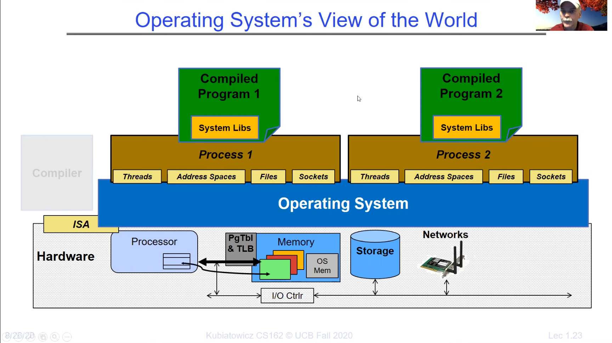

# Lecture 1: What is an Operating System?

An operating system is a piece of software that provides other software
access to the system's hardware resources, and makes it seem much more convenient and less complex. It also 
gives applications isolated environments with useful abstractions of hardware resources.

It is like an illusionist. It provides clean, easy-to-use abstractions of physical resources
and makes it seem to the user as if their machine has infinite memory, and makes it seem 
to the application that it has the entire machine to itself.

The operating system doesn't directly expose the processor and its registers to an application.
Instead, it exposes "threads", which an application runs on. An application can run on one
or more than one thread(s). It does not directly expose the memory to an application. Instead, it exposes "address spaces",
"files", and "directories". It does not directly expose the network adapters and cards to the
application. Instead, it exposes "sockets".

On top of threads, the OS packages each running application into its own "process". This makes it
seem to the application that it has the entire machine to itself, because it isolates the
application from every other application running on the machine. You can think of a process as
and isolated execution environment with restricted rights provided by the operating system.

## Processes

