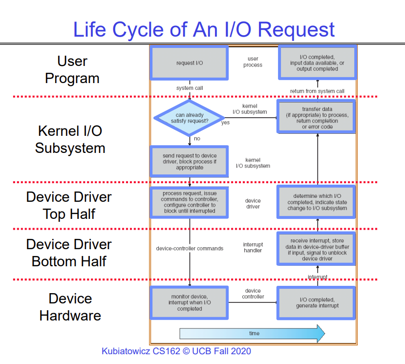
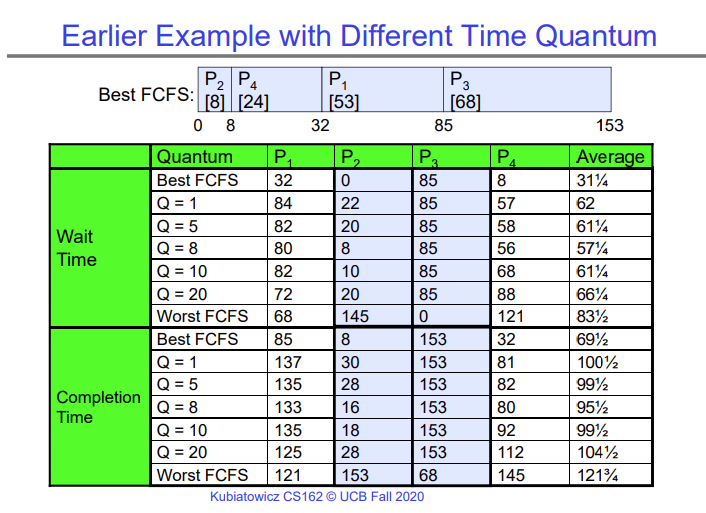

# Lecture 10 - Scheduling 1: Concepts & Classic Policies

In a modern OS, all IO operations have the same interface, usually consisting of `read()`, `write()`, `open()`, `close()`, etc. This applies to file IO, network IO, peripheral device communication, etc. This is possible because of device drivers.

A device driver is software that runs on the kernel thread that corresponds to the user-level thread, and is responsible for providing the standard interface that the OS requires. This way, the device driver takes care of implementing each operation, and exposes it under the standard names like `read()`, `write()`, etc.

The life cycle of an IO request is shown below -

The flow chart is pretty self-explanatory in itself. What is important w.r.t. scheduling is that the thread requesting IO may be put to sleep either by the kernel in the second layer, when the kernel decides that the thread is requesting a large amount of data from some device, or by the top half of the device driver, when it receives the IO request, sends it to the device to process, and then puts the thread to sleep as it waits for the response to come back from the device.

Scheduling is the process of taking all the threads and processes that are waiting to run and choosing which thread or process should get the CPU next. Implementing a first-in-first-out policy may seem like the right thing to do, but that is not always the case. If one user has just one process running and another user has 5 processes running on a shared machine, the second user would get more CPU time just because they have more processes running.

Therefore, the scheduling algorithm that we decide to use has to be chosen carefully depending on the kind of workload we are trying to support. For example, consider the CPU burst model. Most programs use the CPU for a short burst of time, then perform some IO, then use the CPU, and so on. So each program has alternate "bursts" of CPU time and IO time. Now we can decide to schedule programs which are expected to have shorter CPU bursts first, or longer CPU bursts first. Each policy has its own advantages and disadvantages.

## FIFO Scheduling
FIFO scheduling, also known as first-come-first-serve scheduling, is the most obvious scheduling policy. You run every process in the ready queue to completion, and then pick the first waiting process in the ready queue.

However, as you may expect, this is a bad strategy because a process that runs really long can take over the CPU. If a process runs infinitely long, it may take over the computer entirely. Also, if some processes come along which need very little CPU time to finish, they get stuck behind a long-running process and have to wait a long time.

This is a huge problem for responsiveness of the system. If the thread that handles user input via the keyboard has to wait for a few seconds before a long-running process finishes, then the user may not see what they typed on the screen for a few seconds after they type it.

This effect is called the convoy effect, where a short-running job is stuck behind a long-running job.

## Round Robin Scheduling
An improvement over FIFO or FCFS is Round Robin. Round Robin puts an upper limit on the amount of time any process can run, and if it exceeds that time limit, it is preempted and swapped out with another process. This is good, because now the thread that handles user input via the keyboard can still get to run if a long-running process is trying to hog the CPU.

This is a simple but effective solution for the convoy effect, but for it to work well in the real world, we need to tune time quantum that is given to each process. If the time quantum is too large, we effectively revert back to FCFS, and if it is too small, we spend so much time context switching that even the short-running jobs are swapped out multiple times, which ultimately _reduces_ the response time. In the lecture, Kubi shows the effect of different choices of time quantum on the average completion time and the average waiting time for each job.

## Shortest Job First Scheduling
This is a hypothetical version of scheduling that puts the jobs with the shortest running time first. It is hypothetical because it requires us to know the future and know exactly how long each job is going to run. A preemptive variation of this scheduling policy is called Shortest Remaining Time First (SRTF), where if a new job comes along which has an even shorter time to completion that the currently running job, the currently running job is preempted and the new job starts running.

Although this policy is proven to be the best for improving response times, it has another problem (besides needing to know the future). If short jobs keep coming along, long jobs keep getting stuck behind short jobs and potentially never run. If the short jobs never stop coming, long jobs never run. This issue makes this scheduling policy extremely unfair.

In the real world, we use various heuristics to predict how long each job will take, along with trends observed from the previous runs of the job. So we can have an imperfect version of SRTF scheduling.

When writing a scheduler for a real world OS, you may have to come up with and test multiple scheduling policies to see which one works best for the type of workload you have.