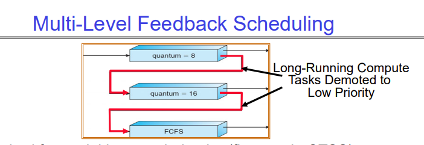

# Lecture 11 - Scheduling 2: Case Studies, Real Time, Forward Progress

## Multi-level Feedback Scheduling
This is a scheduling scheme in which we maintain multiple ready queues instead of just one. Each queue has a different time quantum for round-robin and represents different priority levels.

In the image above, the topmost queue has a time quantum of 8 and is for real-time, short-running jobs. The bottom most queue is for long-running jobs. Each new job gets added to the highest priority ready queue when it arrives for the first time. Then, every time its time slice expires, if it still hasn't finished, it gets dropped one level to the queue below with a longer time slice.

The CPU is shared among all the queues according to some percentage - each queue gets a certain amount of CPU time. That is, the topmost queue could get 70% of the CPU time, the one below it gets 20%, and the bottom most queue gets 10%. That means that 70% of the time, tasks in queue 1 are executing with a time quantum of 8, for 20% of the time, tasks in queue 2 are executing with a time quantum of 16, and for the remaining 10% of the time, tasks in queue 3 are executing FCFS.

## Case Study: Linux O(1) Scheduler
The Linux scheduler for a while was a variant of the Multi-level feedback scheduler you saw above. Instead of 3 read queues, it had 140, of which the first 100 (of highest priority) were for real time tasks, and the remaining 40 were for user tasks.

It was a O(1) time scheduler, which means that it took constant time to run and figure out which job should be scheduled next. It achieved this by computing a large amount of heuristics every time it was called and maintaining a copy of all the 140 ready queues. Once a job was dequeued and started to run, it was put into the copy queue, and then the pointer to the active queue was swapped to point to the copy queue.

However, even though the scheduler worked well, it because impossible to maintain because the number of heuristics it used and their complexity grew too much, to the point that it was just discarded and completely replaced with a new policy.