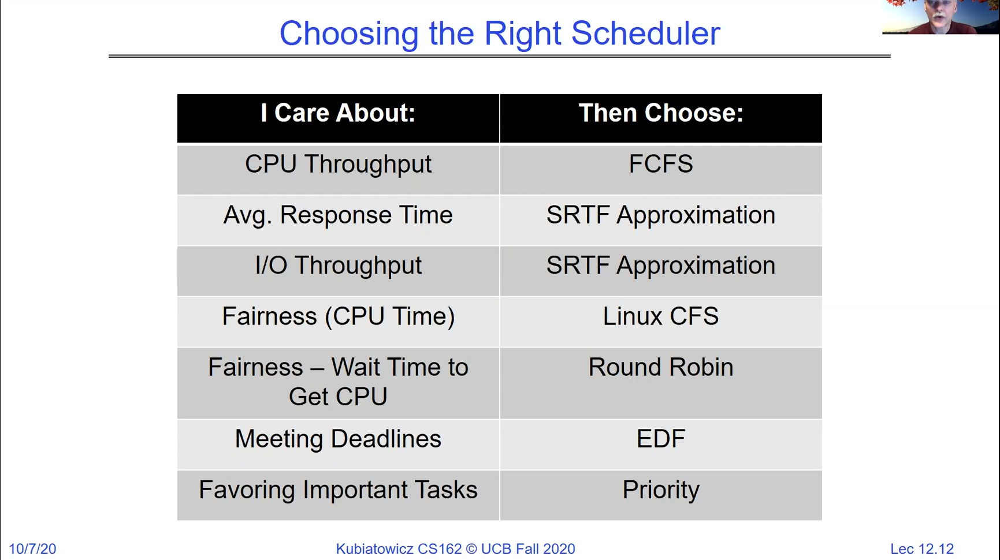
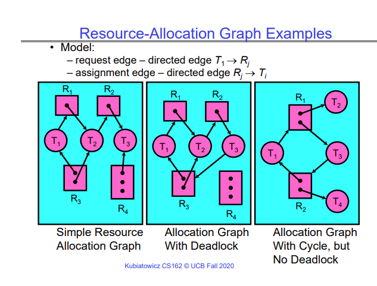
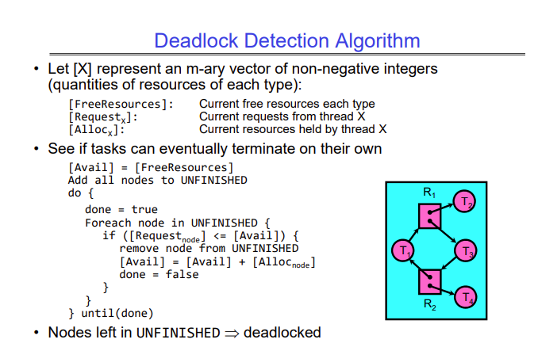

# Lecture 12 - Scheduling 3: Deadlock

## Linux Completely Fair Scheduler
The scheduler used in Linux (as of the lecture in August 2021) is called the "Completely Fair Scheduler", and it approaches scheduling differently than a traditional round-robin or real-time scheduler. It tries to give every thread the same amount of time on the CPU, so if there are N threads, each thread gets 1/N of CPU time.

As each thread is running, the scheduler keeps track of how long the thread ran. Each thread has an allocated time slice, and if a thread gives up the CPU and goes to sleep before its time slice has expired, then it gets more priority to run when it wakes up, because the scheduler wants to make sure that each thread gets the same amount of time on the CPU.

The Linux CFS has a target latency, which is the period of time over which it wants to make sure that all threads are run at least once. For example, if the target latency is 20ms, and there are 5 threads to be scheduled, it will schedule each thread to run for 4ms, and keep track of the threads that run for a shorter (or longer) time.

However, if the target latency is 20ms, and there are 200 threads to be scheduled, then each thread gets a 0.1ms time slice, which may be too small, since we have to spend some time context-switching. Therefore, the CFS scheduler has a lower bound on the time slice, say 1ms. So in this case, all 200 processes will get a 1ms time slice, and we will not be able to meet our latency goal of 20ms.

So far this looks like a slightly modified version of round-robin, but the difference becomes clear when we see how CFS handles job priorities. It allows you to give each job (thread) a priority, and then instead of calculating the time slice for each thread equally, it calculates the time slice to give based on the weight of the job. The weight of the job is decided by the "nice" value of the job. A nice value typically ranges between -20 to 19, and a higher nice value means lower priority.

The weight of a job is calculated as 

$$ weight = \frac{1024}{1.25^{nice}} $$

The virtual time slice of a job is then calculated as 

$$ max(min slice, \frac{Wi}{\sum_{p}^{}{Wp}}*target latency) $$

Where w_i is the weight of the ith job. CFS then tries to give every job this virtual time slice instead of real time.

## Deadlock
A deadlock is a type of starvation that never resolves, and only occurs non-deterministically, when the schedule creates a cycle of accessing resources. A deadlock can be caused due to any resource - locks, terminals, memory, printers, sockets, pipes, etc.

There are 4 conditions that are necessary (but not sufficient) for deadlock to occur -

1. Mutual exclusion - There has to be a resource that only one thread can access at a time.
2. Hold and wait - A thread holding at least one resource is waiting to acquire more resources held by other threads.
3. No preemption - Resources are only released voluntarily by the thread, and the kernel cannot preempt it into giving up the resource
4. Circular wait - There exists a set of threads {T1, T2, ..., Tn} such that
    - T1 is waiting for a resource held by T2
    - T2 is waiting for a resource held by T3
    - ...
    - Tn-1 is waiting for a resource held by Tn
    - Tn is waiting for a resource held by T1

In order to detect deadlock, we can build a resource-allocation graph. A resource-allocation graph is a graph with 2 types of vertices - one representing threads and one representing resources. It has directed edges that signify the following -

- A directed edge from a thread vertex T to a resource vertex R means that the thread T is requesting resource R.
- A directed edge from a resource vertex R to a thread vertex T means that the thread T has ownership of resource R.

The slides show a few examples of resource allocation graphs. Below, a resource vertex has one or more dots which represent an instance of the resource.

### Detecting Deadlock
Just because there is a cycle in this graph does not mean that there will be deadlock. To detect deadlock, we have a simple algorithm. Instead of describing it here, I'll just attach a screenshot of the lecture slide.

### Dealing with Deadlock
There are 4 common ways of dealing with deadlock -

- Deadlock prevention - Write your code in such a way that deadlock won't occur. This means that you trust the apps running on your machine to be written this way as well.
- Deadlock recovery - Let deadlock happen, and then figure out how to recover from it, maybe by rolling back a transaction (if transactions and rollbacks are supported).
- Deadlock avoidance - Dynamically delay resource requests so that deadlock doesn't happen. Requires you to do extra work while writing and maintaining the kernel.
- Deadlock denial - Don't deal with deadlock 🤷‍♂️

The Linux operating system makes sure that the kernel is not involved in any deadlock, but ignores any deadlock that happens in applications.

There is an algorithm that can detect if allocating a resource to a particular thread would lead to deadlock called the banker's algorithm (described in the lecture and the slides).