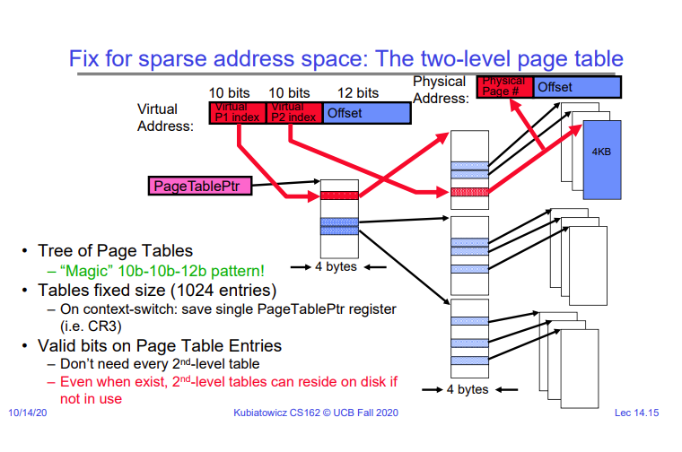

# Lecture 14 - Memory 2: Virtual Memory, Caching and TLBs
So far, the implementation of paging that we have seen is not very efficient. If we assume that a page is 4KB, then we need 12 bits to represent the offset into each page. If we have a 32 bit machine, then the remaining 20 bits will be used as an index into the page table, which means that the page table has to have 2^20  entries, each of 4 bytes, which means we use around 4MB to store the page table for a process. That may not be too much for today's machines to handle, but if we have a 64 bit machine, then using a 12 bit offset, we use 52 bits as an index into the page table, which means our page table takes around 36 exabytes.

How do we fix this? We can split the page table into multiple levels. Instead of just having one "level" of virtual address translation, we can have two. Considering the example of a 32 bit machine, we would have 12 bits for the offset into the page, and then instead of using the remaining 20 bits as an index into the page table, we will use only the top 10 bits. These 10 bits will be used to index into a table which will point to the next "level" of the page table. Then the next 10 bits will give us the actual physical page.

As processor cores get bigger and bigger and we start getting to 64-bit architectures, even multi-level page tables start becoming infeasible. In that case, we can switch to using a hash table. A hash table has the advantage that its size only depends on the number of pages used by the process, and not the size of the virtual address space. However, this means that we don't have cache locality, and managing this hash table is more complex than a simple page table.

## TLBs
There is one issue with the concept of paging that we must address. The issue is that we have effectively made all caching useless because in order to check if an address is in the cache, we have to translate it to a physical address, for which we have to go to the page table, which is stored in DRAM!

A simple solution to this is to add another cache for storing virtual addresses and their mapping to physical addresses. This is called the TLB - Translation Look-aside Buffer.