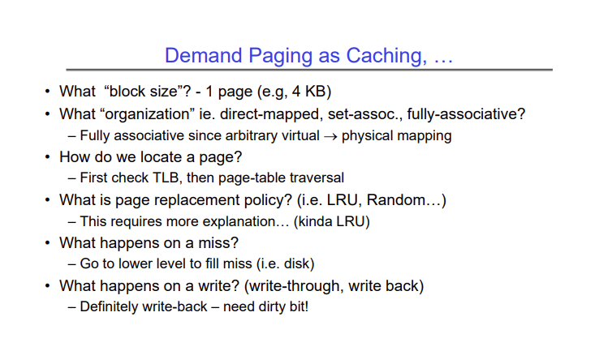

# Lecture 15 - Memory 3: Caching & TLBs, Demand Paging

Demand paging is a simple but powerful idea. Most modern programs require a lot of memory, but they don't use all of their memory at once. On average, they follow the 90-10 rule - 90% of the time the program executes 10% of its code, and 90% of the time, the program only needs 10% of its memory.

We can use this trend to our advantage in order to keep only the most used data in DRAM and cache, and the rest out on disk, instead of trying to load the entire program and the data it needs into the DRAM.

In demand paging, we don't fully populate the page table when we load a program into memory. As the program runs, it tries to access a page that is not mapped by the page table. In this case, we get a page fault, which is equivalent to a cache miss. We then go out to disk and load the page into memory, update the page table, and run the instruction again.

