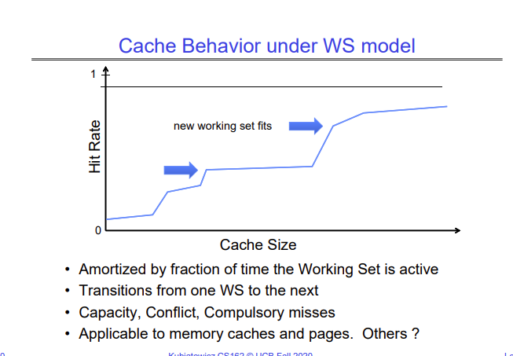
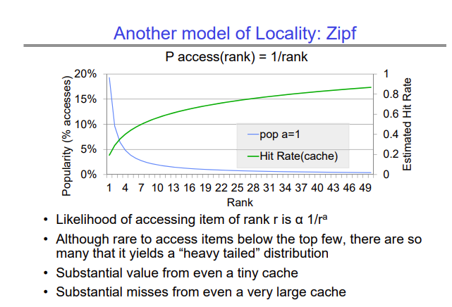

# Lecture 16 - Memory 4: Demand Paging Policies

Demand paging aims to improve the average memory access time. The average memory access time (AMAT) can be calculated as -

`AMAT = Hit Rate x Hit Time + Miss Rate x Miss Time`

Which can be simplified to 

`AMAT = Hit Time + Miss Rate x Miss Time`

You can think of demand paging as being a cache managed in software. The pages live on the disk, and only the pages that are needed are brought from the disk into the DRAM. The mechanism of demand paging is as follows -

1. Processor tries to access an address
2. It checks the page table entry for the address
   1. If the entry is valid, we go ahead and access that physical address
   2. If it is invalid, we get a page fault, and we need to get that page from the disk into DRAM

In case we get a page fault, the OS gets the page from the disk into DRAM -

1. Choose an old page to replace (assuming we don't have free space in DRAM)
2. If the old page is modified, write it back to disk
3. Change the page table entry and TLB entry to be invalid
4. Load new page from disk into DRAM
5. Update the page table entry and invalidate the TLB entry to force the MMU to fetch the new address
6. Retry the memory access that faulted before

## Memory Access Behaviors
There are two common types of memory access behaviors that a process follows - 

1. A process has a specific set of pages that it accesses, and it doesn't access any other pages. This working set can change over time.
2. A process does not have a specific set of pages it accesses, but it accesses some pages more frequently than others. In this case we can say that some pages are popular for a process, and give each page it accesses a rank depending on the number of times it is accessed.

Cache hit rate under the working set model grows in steps as the cache size increases.

Cache hit rate under the Zipf model grows logarithmically as the cache size increases.

## Demand Paging Replacement Policies
When we implement demand paging, we have to take a special care about the replacement policy we use to choose which page to evict from the DRAM to make space for the new page we will bring in from the disk. This is because the cost of a miss/page fault is huge, since going out to the disk takes around 1M cycles. This means that if you start page faulting, your performance comes to a grinding halt very fast.

In the lecture, Kubi shows a rough calculation which shows that even if you have a miss rate of 1 in 1000, you slow down by a factor of 40! If you want to keep your effective memory access time to be only around 10% more than accessing a page from DRAM, you need a miss rate of less than 0.00025% or 1 in 400,000.

The lecture covers a few replacement policies -

1. FIFO - Replace the page that came in first. This is a bad policy, since it is likely that the page that came in first could be a page that is accessed very frequently.
2. Random - This works well for caches since the miss penalty of a cache means going to the DRAM, which is not as bad. However, when the miss penalty is going out to the disk, we cannot risk randomly choosing a very frequently accessed page.
3. Min (Optimal) - Replace the page that will be used farthest in the future. This strategy is provably optimal, but we obviously can't implement it because we can't know the future.
4. LRU - LRU is a good approximation for Min, but it is not practical to implement since it involves operations that have high time complexity.