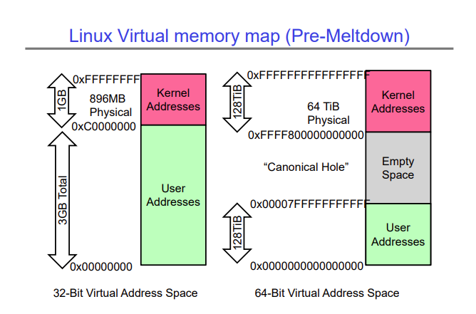

# Lecture 17 - Demand Paging, General I/O, Storage Devices
An important design decision is how many page frames we should give to each process/thread. Too few page frames (memory) allocated to a process will lead to thrashing, where the process just spends all or most of its time swapping pages in and out of memory. Too many frames allocated to a process will waste memory that could have gone to a process that needs the extra memory.

We can use a static policy to decide the number of page frames, but it is better to have a dynamic policy that changes the amount of memory allocated to a process based on its behaviour. We can detect that a process needs more memory and that it is thrashing by monitoring the number of page faults it is encountering. A large page fault rate means a process is likely thrashing. We want to keep the page fault rate between an upper limit and a lower limit. We don't want the page fault rate to get too low, because that means we could be allocating too much memory to a process that doesn't need it.

# Meltdown
In 2017, a bug was discovered that allowed a user level program to read kernel code, because of the way memory was mapped by operating systems. The lower addresses of virtual memory were mapped to user addresses, and the upper addresses of virtual memory were mapped to kernel addresses. The image below shows the organization for 32 bit and 64 bit machines. The memory map for 64 bit machines has a big hole (called the Canonical Hole), simply because the address space that can be mapped by 64 bits is huge, and no machine has that much RAM yet.



A user program accessing a kernel address would cause a page fault, and ultimately a core dump.

However, processors have something called speculative execution, which is when an instruction is executed even though it performs an illegal operation (like accessing kernel level addresses), or when a branch prediction is needed, etc, and when the illegal operation (or error) is discovered, all the registers relating to that instruction are cleared so that no data is leaked. This technique is usually beneficial and improves the speed of the processor.

Meltdown exploited this technique in a very clever way -

```c
uchar array[256 * 4096];
flush(array);       // Make sure the array is not in cache

try {
    uchar result = *(uchar *) kernel_address;       // Try to access kernel memory
    uchar dummy = array[result * 4096];             // Force the processor to store (result * 4096) in a cache line
} catch () {;}
```

We first try to access some kernel memory, which the processor does successfully because of speculative execution. We then immediately force the processor to cache the value we got from the kernel address in the next instruction. When the processor realizes that we performed an illegal operation, it clears the value of the registers and throws an error, which we catch. However, the value is still in cache. We then try to access each item in the `array` array, and measure the time it takes to access each item. When we get to the index that was in cache, our access time is very fast, so we can tell what value we got back from the kernel address we just accessed.