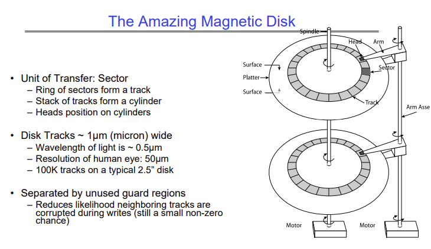

# Lecture 18 - General I/O, Storage Devices, Performance
In previous lectures we have seen that the OS has a standardized interface for communicating with the external world. This means that even though there are hundreds of different types of devices, each of which has a different internal structure, the operating system can work with all of them because the devices support this standardized interface.

This interface is provided to the OS by the device driver. The device driver is a process that knows how to work with the specific hardware of the device, and can work with the device in order to provide the standard API calls to the OS.

There are three main types of devices -

1. Block oriented devices - Devices which access blocks of data, e.g. disk drives. When you read from or write to these devices you can only do so in "blocks" (typically 4KB), and not individual bytes.
2. Character oriented devices - Devices which communicate individual bytes or character, e.g. mouse, keyboard, etc.
3. Network oriented devices - Devices which deal with packets and are slightly different from block or character oriented devices, e.g. ethernet, wireless, bluetooth, etc.

To each of these devices, there are three main types of interfaces -

1. Blocking interface - When a process requests some data from this device, the process is blocked and possibly put to sleep.
2. Non-blocking interface - When a process requests some data from this device, the device returns whatever it can return immediately, and the process continues executing. If the process needs more data, then it must keep asking the device for more data.
3. Asynchronous interface - When a process request some data from this device, it continues executing and the device starts fetching the data. Once the data is ready, the device signals to the process saying that the data it had requested is ready.

# Hard Disk Drives
Although SSDs are becoming more common now, HDDs are still around. HDDs work by storing information on magnetic disks. A track positioned on top of the disk can read or write to the disk.

The disk latency (time taken for a read/write request to be completed) is the sum of the queueing time, disk controller's execution time, seek time, rotational delay, and transfer time.

All of these factors means that HDDs are painfully slow. Their data transfer rate is usually 50 to 250 MB/s.