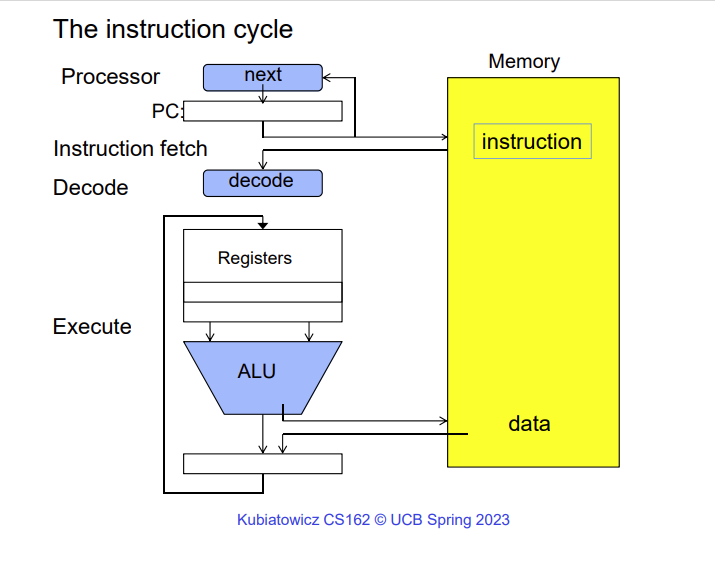
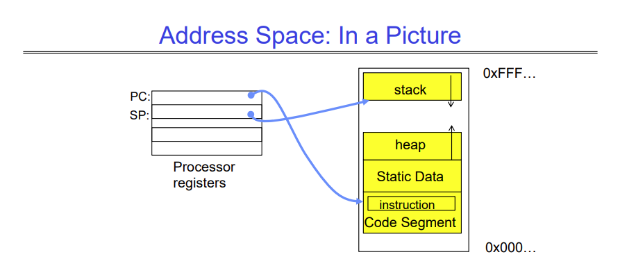
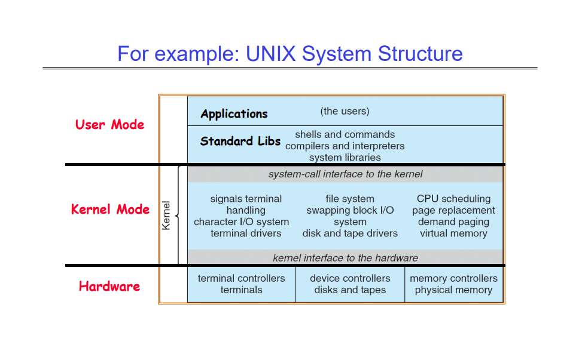

# Lecture 2: Four Fundamental OS Concepts

This lecture introduces four fundamental concepts of an operating system -
1. Threads: Execution Context
2. Address Spaces
3. Processes
4. Dual mode operation

## Threads
A thread is a single unique execution context that has its own program counter, 
registers, execution flags, stack, and so on. This means that the block diagram 
you have studied for how a processor executes a program is really one single 
thread executing its own code.

A thread is said to be executing when it is "resident" in a core. Resident means
that the PC of the core is pointing at the next executable instruction for the 
thread and the instructions of the thread are stored in memory. A resident thread's 
stack pointer holds the address of the top of the stack for that thread.

A thread is said to be suspended when its data (everything we have seen above) is
not in memory.

The OS gives the user the illusion of multiple processors by multiplexing the 
execution of threads in time. All threads that want to run on the processor
are stored in a chunk of memory called the Thread Control Block, and the data
for each thread is swapped in and out of the hardware registers over time.

Swapping out the data of one thread for another takes some time, which is called
context switching. We have to be careful not to swap between executing threads
so often that majority of the time is spent in context switching, since the 
more context switching we perform, the more time is "wasted". However, if we don't
context switch fast enough, we might get the feeling that our machine is unresponsive,
since only one process would be running on the CPU for a long time, making all other
processes hang.

Context switching can also happen because the thread voluntarily gave up control,
or it asked for some i/o, and so on.

## Address Spaces
An address space is a set of addresses that a thread or process can access. A 32-bit
processor can access $2^{32}$ spaces, which is around 4 billion. A 64-bit processor can 
access $2^{64}$ address spaces, which is $~10^{18}$

When a thread or a process writes to an address space, one of many things can happen, 
depending on the type of memory location. A memory location can behave as -

1. A regular memory location, i.e. data written is stored in memory
2. Memory-mapped I/O, i.e. data written is mapped to I/O ports
3. Communication between two or more programs

An address space for a thread or process contains the parts shown above. The code 
segment contains the instructions that are being executed, the static data contains
data that does not change throughout the life of the program (e.g. global variables),
the heap is used to store dynamically allocated memory, and the stack is used to store
local variables.

However, since this address space lives along with other address spaces around it, we
want to make sure that no other thread or process can access this address space.
We also want to make sure that this thread cannot access any other address space,
especially address/memory where the OS lives.

This can be done using a simple check during each memory access. When the thread accesses 
a memory location, the OS first checks if the memory location is within the address
space allocated to this thread. If it is not, then the thread or process can
be killed. The address space therefore has a "base" (the start of the address space),
and a "bound" (the end of an address space).

This simple model has lots of drawbacks, but the biggest one is fragmentation.

To fix that, we use a paged virtual address space. We divide the entire virtual address
space into equal size chunks called pages. Each page has a base, and the bound is the
global page size. All pages are of the same size, so it is easy to manipulate memory 
this way.

The hardware then translates addresses using a page table. A special hardware register stores
a pointer to the page table. This lets us treat memory as a set of pages that are put 
into page frames. The thread or process operates on virtual addresses, and the virtual 
addresses are translated to hardware addresses by the page table.

## Processes
A process is an isolated execution environment with restricted rights. It has an 
address space and contains one or more threads. You can think of it as an encapsulation
of a running program. The process has an address space that is isolated from 
every other address space, but the threads inside the process share everything, 
including memory, hardware resources, network, i/o, etc.

This lets us do concurrency easily. Multiple threads in a single process can run
on different cores (if available).

But one question that needs to be addressed is what stops a process from changing
some data that it owns, that should not be changed (for example, the page table pointer
for this process)? If a process could change its own page table pointer, the 
security offered by the concept of address spaces would mean nothing.

This is solved by the fourth concept: privilege levels and dual mode operation.

## Dual Mode Operation
The hardware itself has at least two modes, kernel mode and user mode, which 
essentially give us privilege levels. Almost all processes installed in the 
machine can only run in user mode, which stops them from accessing/changing
sensitive data. Certain operations are prohibited when a process is running 
in user mode, for example changing the page table pointer, disabling interrupts,
interacting with the hardware directly, or accessing any memory outside its 
address space.

If the process needs to perform a "sensitive" operation, the OS provides a controlled
transition between user mode and kernel mode.

The OS can itself switch between user mode and kernel mode if any of the following
happen -

1. syscall
2. Interrupt
3. Exception