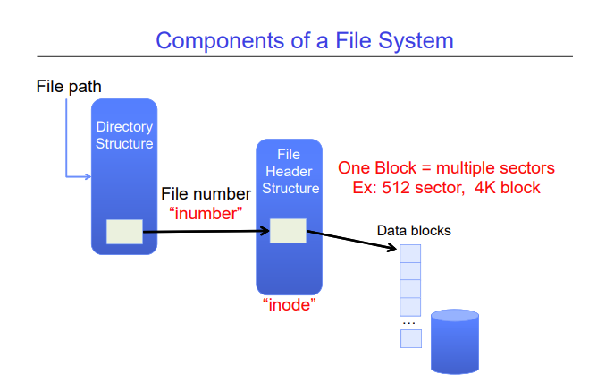
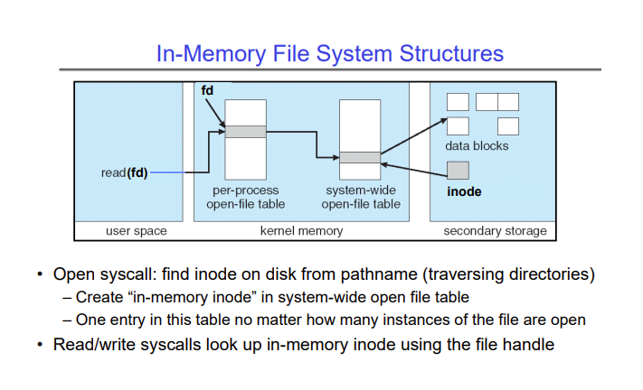

# Lecture 20 - Filesystems 2: Filesystem Design, Case Studies
The filesystem is responsible for bridging the gap between the API exposed by the operating system to the user (which is byte-oriented), and the API provided by the device driver for the disk to the OS (which is block oriented). The disk only lets you read and write data in blocks which can range from 512 bytes upto 4KB. However, the user is given the illusion that they can access any byte on the disk as they need.

The filesystem provides two entities - files and directories. Files are just a collection of bytes, and a directory is an index that maps a name to a set of files. Each sector of the disk is given an integer address, and the filesystem remembers which files are stored at which addresses.

The filesystem also needs to track additional information such as -

- Free block addresses, in case it has to create new files.
- Which blocks belong to which file, in order to read and write existing files.
- Which directories contain which files.

Since we want all of this data to be persistent after the machine is shut down, we will need to store this data somewhere on the disk. This may become a recursive problem! We can solve this using a small set of fixed addresses for this metadata, or some standard positions for the root of the filesystem.

## Components of a File System
A file system has two components - a directory structure map, and a file header structure. The directory structure map is a mapping in a directory that maps a file name to a file number (called an inumber). This inumber is used to find the inode of a file (also called the file header). The inode of a file contains a list of all the blocks that belong to the file.

When a process opens a file, a name resolution is performed in the directory structure to first find the inumber of the file. This inumber is used to look up the inode of the file. This inode describes all the blocks that belong to the file, and now we can read/write these blocks as we want.

A directory in a file system is actually a file that contains a list of mappings of the format `<file_name: file_number>` for all the files the directory contains. Each of these `<file_name: file_number>` mapping is called a directory entry, and these are stored in a format that the OS decides. The OS doesn't let a user process read the raw bytes of a directory (the directory entries), because if these entries are corrupted by an incorrect user process, all the data in the directory could be lost.

When we perform actions on these directories like creating them, moving them, or deleting them, we are actually just modifying this structure. So syscalls like `open`, `create`, `readdir` traverse this structure, and `mkdir`, `rmdir` add/remove entries from this structure.

For example, say you wanted to open a file `/my/book/count`. The OS follows the following steps -

1. Read the file header (inode) for the root `/`.
2. Using the inode, read the first data block for the root.
3. In this data block, find the directory entry for `my`.
4. If we find it in this block, we proceed, otherwise we read in the next block and look for it there.
5. Once we find the directory entry for `my`, we read the first block for `my`.
6. We look for the directory entry for `book`.
7. We read the first block for `book`.
8. We look for the directory entry for `count`.
9. We get the inode for `count`, and now we can read the blocks for `/my/book/count` as we need.

This is all stored on the disk, however, when we try to open a file, these structures are also created in memory -

Each process has a table that contains the file descriptors of the files the process has opened. When the `open` syscall is executed, a file descriptor is created for the file and stored in this table. This file descriptor points to an entry in a system-wide open file table, which contains the inode of this file, fetched from the disk and put into RAM.

## Case Study: File Allocation Table (FAT)