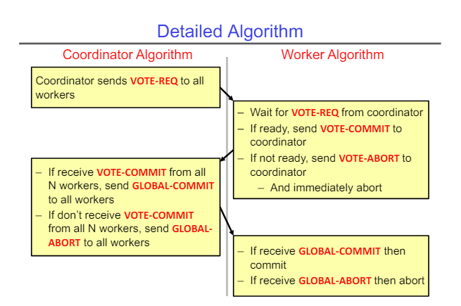

# Distributed Decision Making, Networking, TCP/IP

## General's Paradox
The general's paradox is a problem in which two generals have to decide on a particular time to coordinate their attack. They can only exchange physical messages through messengers, who can be captured by the enemy. If they successfully decide on a time to attack, they will succeed. If they cannot decide on a time and attack at different times, they will fail.

The general's paradox doesn't have a solution. Since the messengers can be captured, you can never be sure that the last message you sent was received. So even if you send an ACK, you can never be sure that the other person got the ACK.

## Two-Phase Commit
The two-phase commit protocol was developed by Jim Gray, a Turing award winner and Berkeley alumni. The two-phase commit protocol solves a problem related to the General's paradox, since we cannot solve the general's paradox itself. 

The 2PC algorithm has one coordinator node and n workers who are trying to decide whether to commit or abort a transaction. The transaction can be a database transaction, a distributed file system transaction, or any other action that can be committed or aborted.

The high-level overview of the algorithm is -

1. The coordinator asks all workers if they want to commit or abort
2. All workers decide individually if they are ready to commit or if they want to abort
3. All workers reply with their desired action
4. If the coordinator receives "commit" from all workers, it sends a "global-commit" message to each worker, which causes each worker to commit their transaction
5. If the coordinator receives at least one "abort", it sends a "global-abort" message to each worker, which causes each worker to abort their transaction

All workers and the coordinator have an internal log in which they record their decision so that they will remember their decision even after a crash.

