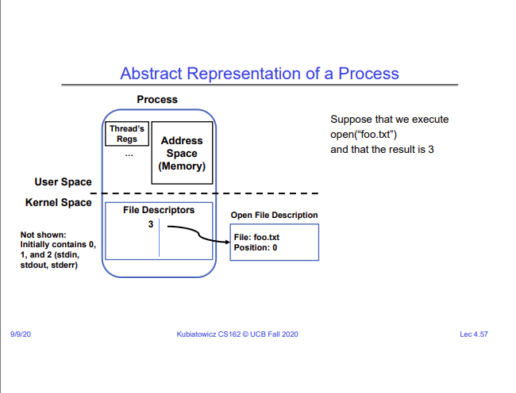

# Lecture 4 - Abstractions 2: Files and I/O

## Semaphores
Semaphore are a kind of generalized locking mechanism. A semaphore is just a 
number associated with critical section of code. It was first defined by Dijkstra
in the 60s. A semaphore is a non-negative integer that supports the following 
operations -

1. `P()` or `down()` - An atomic operation that waits for the semaphore to become
    positive, then decrements it by 1.
2. `V()` or `up()` - An atomic operation that increments the semaphore by 1, and 
    then wakes up a waiting `P`, if any.

This concept of semaphores can be used in two patterns. One is for mutual exclusion,
which is easy to see. We set the initial value of the semaphore to be 1. Each thread 
first checks the value of the semaphore before entering the critical section. If the
value is greater than 0, the thread enters the section and decrements the semaphore.
If the value is 0, the thread is put to sleep and waits for the semaphore to increment.

The other pattern is for waiting for a thread to finish execution and join the main
thread (or some other thread). We set the initial value of the semaphore to 0. When
the main thread tries to decrement it, it is put to sleep. Then, another thread finishes
its execution and increments the semaphore. This wakes up the main thread, and the
main thread then takes over the execution. Essentially, we made the main thread
wait for some other thread to join.

## Processes & Signals
A common way of having one program launch or quit other programs is using `exec()` and
signals from the process management API. `exec()` stops the execution of the current 
process, and gives up control to some other process that is specified as an argument
to `exec()`. This is how the shell starts new programs. Look at the example code below -

```c
pid = fork();
if (pid == 0) {
    // This is the child process launched by the parent
    exec(...);      // Start some other (child) process
}
else {
    wait(&stat);   // Wait for the child process to finish and exit
}
```

## Files
A key idea in Unix/POSIX is that everything is a file. This means that (almost) all
system calls have an identical interface. POSIX gives an identical interface for -

1. Files
2. Devices (terminals, printers, etc.)
3. Networking sockets
4. Interprocess communication (pipes, sockets)

and more. This standard interface is based around the system calls `open()`, `read()`,
`write()`, `close()`. If you are writing a device driver that doesn't necessarily fit into this interface,
you can use `ioctl()`, which stands for I/O control. A "folder" is just a special type of
file that maps to a set of other files/folders, instead of having any arbitrary
content.

The high level abstractions of files is streams. A stream is just an unformatted sequence
of bytes. Kubi then explains the API C gives us for working with streams/files, which 
I won't write about here, since it is fairly simple and can be looked up if you need it.

## File Descriptors
A file descriptor is just an integer that corresponds to an entry in a system-wide file description
table that is maintained by the kernel. The kernel maintains a list of open files, and a list of
processes and which files they have access to.

On a successful call to `open()`, which is a low level function to open files (or anything that
behaves like a file, which is everything), a file descriptor for the corresponding file is
returned to the user, and an open file description is created in the kernel.

For each process, the kernel maintains a mapping from the file descriptor to the open file
description. On performing system calls (e.g. `read()`), the kernel looks up the open file
description using the file descriptor and services the system call.



Since everything in POSIX is a file, stdin, stdout, and stderr also have file descriptors 
associated with them. The file descriptors associated with these are -

- stdin -> 0
- stdout -> 1
- stderr -> 2

Not only that, but this means that other hardware resources like sockets also have file descriptors
associated with them.

File descriptors is how pipes can be implemented. If you take the file descriptor for the stdout
for a process, and map it to the file descriptor for stdin for another process (using the pipe
function), then the output of one process is fed to the input of another process.

All calls to high-level file handling APIs like `fread()`, `fwrite()`, etc. are buffered at the
user level. This is how they are able to provide us functionality like "read until the next newline".
Moreover, all reads and writes are also buffered at the kernel level by the OS. Another reason for
having buffers at both the user and kernel level is because buffering in user level is faster than 
having to access the kernel buffer, for which the process would need to go into kernel mode (or 
make a syscall).

When you `fork()` a process, all of its file descriptors are also copied. This means that both
the parent and the child process can read and write to and from the same file. This is a useful
way to have the processes communicate with each other. This works not only for files, but also
for hardware resources like network sockets.