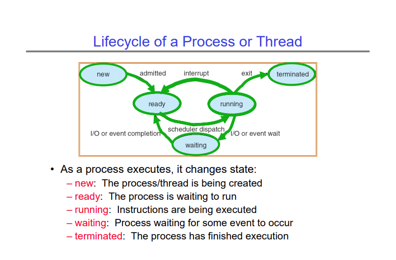

# Lecture 6: Synchronization 1: Concurrency, Mutual Exclusion

## Concurrency
One of the most important and central parts of the operating system is the scheduler.
The scheduler maintains a queue of the active processes in the system and chooses which
process gets to go next.

The scheduler maintains a data structure containing the process control blocks, and distributes
CPU time to the different PCBs it contains according to some policy. It can also distribute
access to other hardware resources like memory, IO, etc.

The lifecycle of a process is shown in the diagram below -



The pseudocode of the scheduler basically looks like this -

```
while (1) {
    RunThread();
    ChooseNextThread();
    SaveStateOfCPU(currPCB);
    LoadStateOfCPU(nextPCB);
 }
```

One can even argue that this is all that the operating system does.

## Context Switching
When the scheduler decides to run a thread, it essentially gives up control of the CPU 
to the process it decided to run. It needs some way to get that control back from the process.

This can happen because of internal events, i.e. the thread yields control voluntarily, or
because of external events like interrupts. The POSIX API provides a syscall `ptherad_yield()`
or `sched_yield()`, that give up control of the CPU.

When a process yields, it goes into the kernel, tells the scheduler to run a new thread, and then 
performs a context switch. The context switch basically saves the state of all registers and the stack
of the first thread/process into the TCB/PCB, and loads in the registers and the stack of the 
new thread/process.

Switching between threads is much faster than switching between processes (about 30x faster).

What happens if a process never yields or never does any operation (like waiting for I/O or 
disk read/writes) that causes it to voluntarily give up control of the CPU? In primitive 
operating systems like Windows 3.1, this would cause the OS to crash. Since the OS has 
completely given up control of the CPU to the currently executing process, there is no way
for the OS to regain control of the CPU.

In that case, we use external interrupts. Today's computers have hardware timers that are
configured to interrupt the CPU at a fixed interval. A hardware interrupt is designed to 
stop the currently executing process and transfer control back to the OS.

## Mutual Exclusion
We have seen mutual exclusion in a previous lecture. This lecture goes over the concept
again and shows some examples. When we write multithreaded code, a big problem is 
correctness. Since threads share memory, if multiple threads access the same memory at
the same time, and if at least one of those threads is doing a write, then we run into
a race condition. The result of the program in that case is unpredictable.

The way we fix this is by using locks or semaphores. Before entering a critical section
of code where multiple threads are going to access the same memory, we acquire a lock
over that memory. This lock only lets one thread access that memory at a time. Once
the thread is done using that part of memory, it releases that lock.

## Semaphores
Semaphores are a higher level abstraction than locks. They are a little different, and
can be used in a scenario where using locks is cumbersome. The lecture gives an example
where using a semaphore is better than using a lock.

Consider a publish-subscribe application with producers and consumers connected with a buffer.
We want the enqueue and dequeue operations on the buffer to be atomic, and we want a
producer to go to sleep when it tries to publish an event when the buffer is full, and 
we want a consumer to go to sleep when it tries to read from an empty queue.

Using a lock to enforce this behaviour is not really ideal (you can try to write the pseudocode
for it and see what problems arise). Instead, we use semaphores. The constraints we
have on the resource (the buffer) are the following -

1. If the buffer is empty, the consumer must go to sleep (if it tries to read)
2. If the buffer is full, the producer must go to sleep (if it tries to write)
3. Only one thread can read or write at a time (standard mutual exclusion)

The general rule of thumb is that you have one semaphore for each constraint. So we would
have to following semaphores -

1. `Semaphore fullBuffers`
2. `Semaphore emptyBuffers`
3. `Semaphore mutex`

Then the pseudocode for producers and consumers would look as follows -

```
Semaphore fullSlots = 0;            // No full slots initially
Semaphore emptySlots = buffSize;    // The max size of the buffer
Semaphore mutex = 1;                // Standard mutex

Producer(item) {
    semaphoreDown(emptySlots);      // Decrement empty slots or wait until we have space
    semaphoreDown(mutex);           // Mutex for actual enqueue/dequeue
    Enqueue(item);
    semaphoreUp(mutex);             // Release mutex after enqueue/dequeue
    semaphoreUp(fullSlots);         // Signal that an item has been enqueued. This wakes up sleeping consumers
}

Consumer() {
    semaphoreDown(fullSlots);       // Decrement full slots or wait until there is something in the queue
    semaphoreDown(mutex);           // Mutex for actual enqueue/dequeue
    item = Dequeue();
    semaphoreUp(mutex);             // Release mutex after enqueue/dequeue
    semaphoreUp(emptySlots);        // Signal that an item has been dequeued. This wakes up sleeping producers
}
```

Notice that the `semaphoreDown()` operation is used to keep track of the amount of available resources,
in this case the space in the buffer, and the `semaphoreUp()` operation is used to signal that
some change has taken place in the resource. This is why we have two semaphores. The `fullSlots` 
semaphore signals that at least one item has been enqueued, and wakes up any sleeping consumers.
The `emptySlots` semaphore signals that the queue has some space left, and wakes up any
sleeping producers.